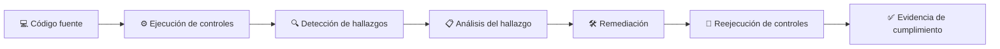
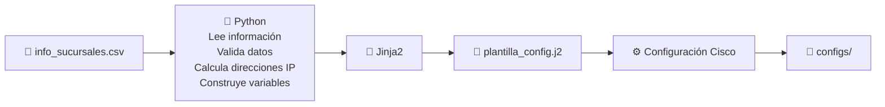
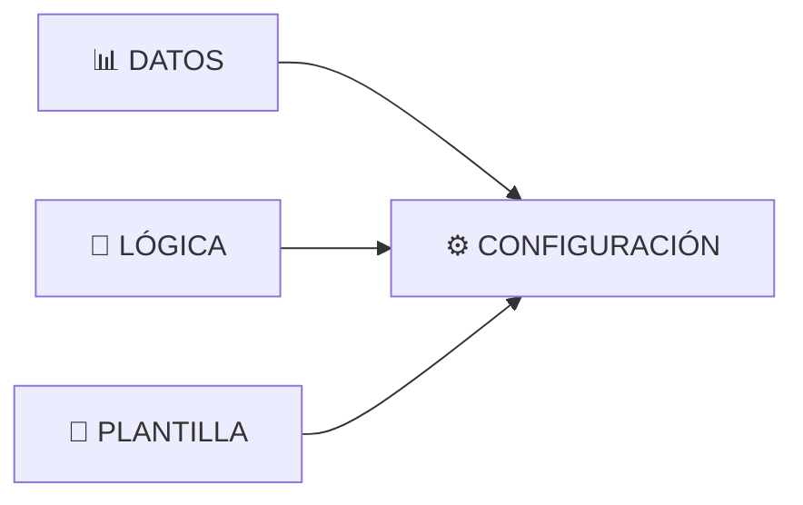

# 🛡️ Guía de Laboratorio  
## Auditoría Automatizada de Código Python mediante GitHub Actions

> **Asignatura:** Auditoría de Sistemas de Información  
> **Programa:** Maestría en Seguridad Informática  
> **Modalidad:** Laboratorio práctico  
> **Tecnologías:** Python · Git · GitHub · GitHub Actions · pytest · pytest-cov · Ruff · Bandit · pip-audit · Jinja2

---

## 📑 Tabla de contenido

1. [🎯 Propósito del laboratorio](#-propósito-del-laboratorio)
2. [🎓 Resultados de aprendizaje](#-resultados-de-aprendizaje)
3. [🧩 Escenario del laboratorio](#-escenario-del-laboratorio)
4. [🧰 Requisitos previos](#-requisitos-previos)
5. [🏗️ Creación y estructura del proyecto](#️-creación-y-estructura-del-proyecto)
6. [📄 Creación de los archivos funcionales](#-creación-de-los-archivos-funcionales)
7. [🧪 Pruebas unitarias](#-pruebas-unitarias)
8. [🔗 Prueba de integración](#-prueba-de-integración)
9. [▶️ Ejecución local](#️-ejecución-local)
10. [🔍 Herramientas de auditoría](#-herramientas-de-auditoría)
11. [⚙️ Workflow funcional](#️-workflow-funcional)
12. [🛡️ Workflow de auditoría de código](#️-workflow-de-auditoría-de-código)
13. [📊 Pruebas y cobertura](#-pruebas-y-cobertura)
14. [🔐 Análisis SAST con Bandit](#-análisis-sast-con-bandit)
15. [📦 Auditoría de dependencias](#-auditoría-de-dependencias)
16. [📍 Primera ejecución: baseline](#-primera-ejecución-baseline)
17. [⚠️ Experimento controlado: falla intencional](#️-experimento-controlado-falla-intencional)
18. [🧾 Análisis del hallazgo](#-análisis-del-hallazgo)
19. [🛠️ Remediación](#️-remediación)
20. [🔁 Revalidación](#-revalidación)
21. [📈 Interpretación de resultados](#-interpretación-de-resultados)
22. [📦 Artifacts como evidencia de auditoría](#-artifacts-como-evidencia-de-auditoría)
23. [📋 Comparación antes/después](#-comparación-antesdespués)
24. [✅ Evidencias solicitadas](#-evidencias-solicitadas)
25. [💭 Preguntas de análisis](#-preguntas-de-análisis)
26. [🏁 Conclusiones](#-conclusiones)

---

# 🎯 Propósito del laboratorio

El propósito de este laboratorio es implementar un proceso automatizado de **auditoría de código dentro de un pipeline CI/CD**, utilizando GitHub Actions para evaluar atributos de calidad, funcionamiento y seguridad de una aplicación desarrollada en Python.

Durante la práctica se analizará una aplicación que genera automáticamente configuraciones para dispositivos Cisco a partir de información almacenada en un archivo CSV y una plantilla Jinja2.

El estudiante implementará controles automatizados para evaluar:

- calidad y consistencia del código;
- cumplimiento de formato;
- funcionamiento mediante pruebas unitarias;
- funcionamiento mediante pruebas de integración;
- cobertura de código;
- vulnerabilidades potenciales en el código fuente;
- vulnerabilidades conocidas en dependencias;
- generación y conservación de evidencias de auditoría.

> [!IMPORTANT]
> El objetivo del laboratorio no es únicamente obtener un pipeline en estado **PASS**, sino comprender cómo cada control genera evidencia técnica que puede ser interpretada dentro de un proceso formal de auditoría.

El laboratorio incorpora una **falla controlada** para observar cómo los controles detectan una desviación, generan evidencia y pueden bloquear el pipeline.

### Ciclo de auditoría aplicado

---

# 🎓 Resultados de aprendizaje

Al finalizar el laboratorio, el estudiante estará en capacidad de:

1. Identificar categorías de controles automatizados aplicables al código fuente.
2. Implementar pruebas unitarias y de integración mediante `pytest`.
3. Evaluar calidad y formato de código Python mediante `Ruff`.
4. Ejecutar análisis estático de seguridad mediante `Bandit`.
5. Analizar vulnerabilidades conocidas en dependencias mediante `pip-audit`.
6. Determinar la cobertura alcanzada por una suite de pruebas.
7. Implementar **quality gates** y **security gates** mediante GitHub Actions.
8. Interpretar los resultados producidos por un pipeline de auditoría.
9. Generar y conservar evidencias mediante **GitHub Actions Artifacts**.
10. Diferenciar entre detección, análisis, remediación y revalidación de un hallazgo.

---

# 🧩 Escenario del laboratorio

Se dispone de una aplicación Python cuya función es generar configuraciones para routers Cisco.

### Flujo funcional



La aplicación será sometida posteriormente a controles automatizados de auditoría.

---

# 🧰 Requisitos previos

El equipo de trabajo deberá disponer de:

- Python 3.12;
- Git;
- una cuenta de GitHub;
- acceso a una terminal;
- editor de código;
- conexión a Internet.

### Verificación de Python

```bash
python3 --version
```

### Verificación de Git

```bash
git --version
```

---

# 🏗️ Creación y estructura del proyecto

Crear un directorio independiente:

```bash
mkdir code_tests
cd code_tests
```

Inicializar Git:

```bash
git init
```

Crear los directorios:

```bash
mkdir -p docs
mkdir -p configs
mkdir -p tests
mkdir -p reports
mkdir -p .github/workflows
```

### Estructura final

```text
code_tests/
│
├── .github/
│   └── workflows/
│       ├── ci.yml
│       └── code-audit.yml
│
├── configs/
│
├── docs/
│   ├── info_sucursales.csv
│   └── plantilla_config.j2
│
├── reports/
│
├── tests/
│   ├── __init__.py
│   ├── test_config_generator.py
│   └── test_integration.py
│
├── .gitignore
├── main.py
├── requirements.txt
└── requirements-audit.txt
```

### Responsabilidad de cada componente

| Componente | Función |
|---|---|
| `main.py` | Lógica principal de la aplicación |
| `docs/` | Datos de entrada y plantilla Jinja2 |
| `configs/` | Configuraciones generadas |
| `tests/` | Pruebas unitarias y de integración |
| `reports/` | Evidencias generadas por herramientas de auditoría |
| `.github/workflows/` | Automatización CI y auditoría |
| `requirements.txt` | Dependencias funcionales |
| `requirements-audit.txt` | Herramientas de testing y auditoría |

---

# 📄 Creación de los archivos funcionales

## 1. `requirements.txt`

Este archivo contiene las dependencias necesarias para ejecutar la aplicación:

```text
jinja2>=3.1,<4.0
```

Instalar:

```bash
python -m pip install -r requirements.txt
```

### Función de Jinja2

Jinja2 es un motor de plantillas que permite separar:



Esto evita construir manualmente cada línea de configuración desde Python.

---

## 2. `requirements-audit.txt`

Crear:

```text
pytest>=8.0
pytest-cov>=5.0
coverage>=7.0
ruff>=0.12
bandit>=1.8
pip-audit>=2.9
```

Instalar:

```bash
python -m pip install -r requirements-audit.txt
```

> [!NOTE]
> Estas herramientas no son dependencias funcionales de la aplicación. Se emplean exclusivamente para testing, análisis y auditoría.

---

## 3. `docs/info_sucursales.csv`

Crear:

```csv
PAIS,ESTADO,ID_SITIO,SUBRED/24,REGION
EC,PICHINCHA,001,10.10.1.0,NORTE
EC,GUAYAS,002,10.10.2.0,COSTA
EC,AZUAY,003,10.10.3.0,SUR
```

Cada registro contiene información utilizada posteriormente para construir la configuración de un router.

---

## 4. `docs/plantilla_config.j2`

Crear:

```jinja2
!
hostname {{ HOSTNAME }}
!
interface Loopback0
 description Management
 ip address {{ IP_MGMT }} 255.255.255.255
!
interface GigabitEthernet0/0
 description DATA-{{ REGION }}
 ip address {{ IP_DATOS }} 255.255.255.0

 ip helper-address {{ helper }}

 no shutdown
!
logging host {{ IP_SYSLOG_N }}
logging host {{ IP_SYSLOG_S }}
!
end
```

La variable:

```text
{{ HOSTNAME }}
```

será sustituida por un valor calculado desde Python.

El bloque:

```jinja2

 ip helper-address {{ helper }}

```

permite generar múltiples servidores DHCP Helper de forma dinámica.

---

## 5. `main.py`

El programa debe implementar cuatro responsabilidades principales.

### A. Determinar rutas

```python
BASE_DIR = Path(__file__).resolve().parent

DOCS_DIR = BASE_DIR / "docs"
CONFIGS_DIR = BASE_DIR / "configs"

CSV_FILE = DOCS_DIR / "info_sucursales.csv"
TEMPLATE_FILE = "plantilla_config.j2"
```

Esto evita depender del directorio desde el cual se invoque Python.

### B. Construir variables Jinja2

La función:

```python
crear_valores_jinja()
```

recibe un registro del CSV y genera:

```text
HOSTNAME
IP_MGMT
IP_DATOS
DATA_HELPER
REGION
IP_SYSLOG_N
IP_SYSLOG_S
```

Para:

```text
10.10.1.0/24
```

se pueden obtener:

```text
IP_MGMT  = 10.10.1.254
IP_DATOS = 10.10.1.1
```

El manejo explícito de errores debe privilegiarse frente a capturas genéricas:

```python
except KeyError as exc:
    raise ValueError(
        f"Campo obligatorio inexistente: {exc}"
    ) from exc
```

> [!TIP]
> Capturar excepciones específicas mejora la trazabilidad, reduce ambigüedad y facilita el análisis automatizado de calidad.

### C. Renderizar la configuración

La función:

```python
crear_config_jinja()
```

debe:

1. cargar la plantilla;
2. renderizar las variables;
3. crear el directorio de salida;
4. generar el archivo;
5. registrar el resultado;
6. devolver la ruta generada.

```text
template_env
     +
plantilla
     +
variables
     │
     ▼
template.render()
     │
     ▼
archivo .txt
```

### D. Ejecutar el procesamiento general

`main()` debe:

```text
Abrir CSV
   │
   ▼
Leer registros
   │
   ▼
crear_valores_jinja()
   │
   ▼
crear_config_jinja()
   │
   ▼
contabilizar resultados
   │
   ▼
return code
```

Códigos de retorno:

```text
0   → ejecución correcta
1   → ejecución con error
130 → interrupción del usuario
```

Finalmente:

```python
if __name__ == "__main__":
    sys.exit(main())
```

Esto permite comunicar el estado de ejecución al sistema operativo y a GitHub Actions.

---

# 🧪 Pruebas unitarias

Crear:

```text
tests/test_config_generator.py
```

El propósito de estas pruebas es validar funciones individuales de manera aislada.

### Fixture de prueba

```python
@pytest.fixture
def sitio_valido():
    return {
        "PAIS": "EC",
        "ESTADO": "PICHINCHA",
        "ID_SITIO": "001",
        "SUBRED/24": "10.10.1.0",
        "REGION": "NORTE",
    }
```

Pruebas recomendadas:

```text
test_crear_hostname
test_calcular_ip_management
test_calcular_ip_datos
test_data_helpers
test_region
test_subred_invalida
test_campo_obligatorio_inexistente
test_generar_archivo_configuracion
```

Ejemplo:

```python
def test_crear_hostname(sitio_valido):
    valores = crear_valores_jinja(sitio_valido)

    assert valores["HOSTNAME"] == "ECPICHINCHARTR001"
```

Prueba negativa:

```python
def test_subred_invalida(sitio_valido):
    sitio_valido["SUBRED/24"] = "999.10.1.0"

    with pytest.raises(
        ValueError,
        match="Error procesando la subred",
    ):
        crear_valores_jinja(sitio_valido)
```

> [!IMPORTANT]
> Una suite de pruebas efectiva debe incluir escenarios válidos e inválidos.

---

# 🔗 Prueba de integración

Crear:

```text
tests/test_integration.py
```

La prueba deberá validar el flujo:

```text
CSV
 │
 ▼
Python
 │
 ▼
Jinja2
 │
 ▼
archivo generado
 │
 ▼
validación del contenido
```

Para evitar modificar archivos reales se utilizan:

```text
tmp_path
monkeypatch
```

`tmp_path` crea un directorio temporal.

`monkeypatch` permite modificar temporalmente:

```text
DOCS_DIR
CSV_FILE
CONFIGS_DIR
```

Comprobaciones esperadas:

```python
assert resultado == 0
assert archivo.exists()
assert "hostname ECPICHINCHARTR001" in contenido
assert "10.10.1.254" in contenido
assert contenido.strip().endswith("end")
```

---

# ▶️ Ejecución local

Antes de automatizar el proceso, verificar la aplicación localmente.

### Ejecutar aplicación

```bash
python main.py
```

### Comprobar configuraciones

```bash
ls configs/
```

### Ejecutar pruebas

```bash
python -m pytest -v
```

---

# 🔍 Herramientas de auditoría

| Herramienta | Categoría | Propósito |
|---|---|---|
| `pytest` | Testing | Verificar funcionamiento |
| `pytest-cov` | Coverage | Medir código ejercitado |
| `Ruff` | Static Code Quality | Evaluar calidad y formato |
| `Bandit` | SAST | Detectar patrones inseguros |
| `pip-audit` | SCA | Identificar vulnerabilidades conocidas en dependencias |
| GitHub Actions | CI/CD | Automatizar controles y generar trazabilidad |

---

## 🧪 pytest

Framework utilizado para automatizar pruebas.

**Control evaluado:** funcionamiento.

---

## 📊 pytest-cov / Coverage

Determina qué porcentaje del código fue ejecutado durante las pruebas.

Ejemplo:

```text
Name       Stmts   Miss   Cover
--------------------------------
main.py      100     15      85%
--------------------------------
TOTAL        100     15      85%
```

> [!CAUTION]
> Cobertura alta no equivale a ausencia de defectos ni a seguridad.

---

## 🧹 Ruff

Herramienta de análisis estático orientada a calidad, consistencia y formato.

Puede detectar:

```text
imports incorrectos;
imports sin utilizar;
manejo inadecuado de excepciones;
problemas de logging;
incumplimientos de estilo;
problemas de formato.
```

**Control evaluado:** calidad de código.

---

## 🔐 Bandit

Herramienta **SAST (Static Application Security Testing)** especializada en Python.

Puede reportar:

```text
Rule
Severity
Confidence
CWE
File
Line
```

**Control evaluado:** seguridad del código fuente.

---

## 📦 pip-audit

Analiza dependencias Python y las compara con vulnerabilidades conocidas.

```text
requirements.txt
       │
       ▼
    pip-audit
       │
       ▼
Dependencias
       │
       ▼
Vulnerabilidades conocidas
```

**Control evaluado:** seguridad de componentes de terceros.

---

## ⚙️ GitHub Actions

Automatiza controles ante eventos como:

```text
push
pull_request
```

Permite que los controles sean:

```text
repetibles;
trazables;
automáticos;
reproducibles.
```

---

# ⚙️ Workflow funcional

Crear:

```text
.github/workflows/ci.yml
```

```yaml
name: Functional CI

# Ejecuta el workflow ante cambios en main.
on:
  push:
    branches:
      - main

  pull_request:
    branches:
      - main

# Principio de mínimo privilegio:
# el workflow solo necesita leer el repositorio.
permissions:
  contents: read

jobs:

  functional-tests:

    name: Functional Validation

    # Runner Linux hospedado por GitHub.
    runs-on: ubuntu-latest

    steps:

      # Descarga el código del repositorio.
      - name: Checkout repository
        uses: actions/checkout@v4

      # Configura Python 3.12.
      - name: Setup Python
        uses: actions/setup-python@v6
        with:
          python-version: "3.12"
          cache: "pip"

      # Instala dependencias funcionales y pytest.
      - name: Install dependencies
        run: |
          python -m pip install --upgrade pip
          pip install -r requirements.txt
          pip install pytest

      # Verifica que la aplicación se ejecute correctamente.
      - name: Execute application
        run: |
          python main.py

      # Ejecuta las pruebas automatizadas.
      - name: Execute tests
        run: |
          python -m pytest -v
```

### Objetivo del workflow

> **¿La aplicación funciona de acuerdo con las pruebas implementadas?**

---

# 🛡️ Workflow de auditoría de código

Crear:

```text
.github/workflows/code-audit.yml
```

### Arquitectura de controles

```text
                  RUFF
                    │
          ┌─────────┴─────────┐
          │                   │
        FAIL                 PASS
          │                   │
          ▼                   ▼
        STOP        ┌─────────┼─────────┐
                    │         │         │
                    ▼         ▼         ▼
                 pytest     Bandit   pip-audit
                    │         │         │
                    ▼         ▼         ▼
                Coverage     SAST      SCA
```

Ruff se utiliza como primer **quality gate**.

Los demás jobs emplean:

```yaml
needs: ruff
```

por lo que no comienzan si Ruff falla.

---

## Job 1 — 🧹 Ruff

```yaml
jobs:

  ruff:

    # Identificador del control.
    name: CQ-01 | Ruff Code Quality

    runs-on: ubuntu-latest

    steps:

      # Descarga el código.
      - name: Checkout repository
        uses: actions/checkout@v4

      # Configura Python.
      - name: Setup Python
        uses: actions/setup-python@v6
        with:
          python-version: "3.12"

      # Actualiza pip.
      - name: Upgrade pip
        run: |
          python -m pip install --upgrade pip

      # Instala Ruff.
      - name: Install Ruff
        run: |
          python -m pip install ruff

      # Analiza calidad y reglas de linting.
      - name: Run Ruff lint analysis
        run: |
          ruff check \
            --output-format=github \
            main.py tests

      # Verifica formato sin modificar archivos.
      - name: Run Ruff format validation
        run: |
          ruff format \
            --check \
            main.py tests
```

> [!NOTE]
> El workflow debe **detectar** incumplimientos; la corrección debe realizarse de manera controlada por el desarrollador.

---

# 📊 Pruebas y cobertura

El job de pruebas depende de Ruff:

```yaml
tests-coverage:

  name: TC-01 | Tests and Coverage

  runs-on: ubuntu-latest

  needs: ruff
```

Instalación:

```bash
python -m pip install -r requirements.txt
python -m pip install pytest pytest-cov coverage
```

Creación del directorio de evidencias:

```bash
mkdir -p reports
```

Ejecución:

```bash
python -m pytest \
  --cov=main \
  --cov-report=term-missing \
  --cov-report=xml:reports/coverage.xml \
  --cov-report=html:reports/htmlcov
```

Se generan:

```text
Terminal      → lectura inmediata
coverage.xml  → procesamiento automático
htmlcov/      → reporte visual
```

Carga del artifact:

```yaml
- name: Upload coverage artifact
  if: always()
  uses: actions/upload-artifact@v4
  with:
    name: coverage-report
    path: |
      reports/coverage.xml
      reports/htmlcov/
    if-no-files-found: error
    retention-days: 30
```

---

# 🔐 Análisis SAST con Bandit

```yaml
bandit:

  name: SA-01 | Bandit SAST

  runs-on: ubuntu-latest

  needs: ruff
```

Primero se genera evidencia:

```bash
bandit \
  main.py \
  -f json \
  -o reports/bandit-report.json \
  || true
```

El uso de:

```bash
|| true
```

permite preservar el reporte incluso si existen hallazgos.

Posteriormente:

```yaml
- name: Upload Bandit artifact
  if: always()
  uses: actions/upload-artifact@v4
  with:
    name: bandit-security-report
    path: reports/bandit-report.json
    if-no-files-found: error
    retention-days: 30
```

Finalmente se aplica el security gate:

```bash
bandit main.py -ll
```

```text
Primera ejecución
      ↓
genera evidencia
      ↓
bandit-report.json

Segunda ejecución
      ↓
aplica política
      ↓
PASS / FAIL
```

---

# 📦 Auditoría de dependencias

```yaml
dependency-audit:

  name: SC-01 | Dependency Audit

  runs-on: ubuntu-latest

  needs: ruff
```

Generar reporte:

```bash
pip-audit \
  -r requirements.txt \
  -f json \
  -o reports/pip-audit-report.json \
  || true
```

Subir evidencia:

```yaml
- name: Upload dependency audit artifact
  if: always()
  uses: actions/upload-artifact@v4
  with:
    name: dependency-audit-report
    path: reports/pip-audit-report.json
    if-no-files-found: error
    retention-days: 30
```

Aplicar el security gate:

```bash
pip-audit -r requirements.txt
```

---

# 📍 Primera ejecución: baseline

Ejecutar:

```bash
git add .
git commit -m "Implement automated code audit"
git push
```

En GitHub:

```text
GitHub
   ↓
Actions
   ↓
Code Audit
   ↓
Última ejecución
```

Resultado esperado:

```text
✓ CQ-01 | Ruff Code Quality
✓ TC-01 | Tests and Coverage
✓ SA-01 | Bandit SAST
✓ SC-01 | Dependency Audit
```

Registrar esta ejecución como:

> **Baseline de cumplimiento**

---

# ⚠️ Experimento controlado: falla intencional

El objetivo es comprobar si el control de auditoría detecta una desviación.

Agregar temporalmente en `main.py`:

```python
import subprocess


def ejecutar_comando(comando: str) -> None:
    subprocess.run(
        comando,
        shell=True,
        check=False,
    )
```

> [!WARNING]
> Este código se introduce únicamente con fines académicos. No debe utilizarse como práctica de desarrollo segura.

Realizar:

```bash
git add main.py
git commit -m "Lab: introduce intentional security finding"
git push
```

### Resultado esperado

Las pruebas funcionales podrían continuar pasando.

Bandit debería detectar un patrón potencialmente inseguro.

```text
¿El software funciona?
        │
       SÍ
        │
        ▼
¿Significa que es seguro?
        │
       NO
```

---

# 🧾 Análisis del hallazgo

El estudiante deberá documentar:

| Campo | Descripción |
|---|---|
| **Hallazgo** | Ejecución potencialmente insegura de comandos |
| **Fuente** | Bandit |
| **Tipo** | SAST |
| **Activo afectado** | Código fuente |
| **Riesgo** | Posible command injection ante entrada no confiable |
| **Evidencia** | Resultado del job Bandit y reporte JSON |
| **Tratamiento** | Eliminar o rediseñar el código inseguro |

---

# 🛠️ Remediación

Eliminar la función vulnerable y el import correspondiente.

Verificar localmente:

```bash
ruff check main.py tests
ruff format --check main.py tests
python -m pytest -v
bandit main.py -ll
```

Registrar la remediación:

```bash
git add main.py
git commit -m "Remediate intentional security finding"
git push
```

---

# 🔁 Revalidación

GitHub Actions ejecutará nuevamente los controles.

```text
BASELINE
   │
   ▼
INTRODUCCIÓN DE FALLA
   │
   ▼
DETECCIÓN
   │
   ▼
HALLAZGO
   │
   ▼
ANÁLISIS
   │
   ▼
REMEDIACIÓN
   │
   ▼
RE-AUDIT
   │
   ▼
CUMPLIMIENTO
```

---

# 📈 Interpretación de resultados

| ID | Herramienta | Control | Indicador principal | Interpretación |
|---|---|---|---|---|
| CQ-01 | Ruff | Calidad | Violaciones detectadas | 0 = conforme |
| TC-01 | pytest | Funcionamiento | Tests passed/failed | Todos aprobados = conforme |
| TC-02 | pytest-cov | Cobertura | Coverage % | Mayor cobertura = mayor código ejercitado |
| SA-01 | Bandit | SAST | Hallazgos por severidad | High/Medium requieren análisis |
| SC-01 | pip-audit | SCA | Vulnerabilidades conocidas | 0 = sin vulnerabilidades conocidas detectadas |

---

## 🧹 Interpretación de Ruff

```text
All checks passed!
```

significa:

> Ruff no identificó incumplimientos respecto de las reglas evaluadas.

No significa:

> El programa no contiene errores.

---

## 🧪 Interpretación de pytest

```text
9 passed
0 failed
```

indica que los casos implementados produjeron el comportamiento esperado.

> [!CAUTION]
> `Tests PASS` no equivale a ausencia de defectos.

---

## 📊 Interpretación de cobertura

Ejemplo:

```text
Coverage = 85 %
```

Significa que aproximadamente el 85 % del código considerado fue ejecutado durante las pruebas.

No significa:

```text
Calidad = 85 %
Seguridad = 85 %
```

---

## 🔐 Interpretación de Bandit

Bandit puede incluir:

```text
Severity
Confidence
CWE
Location
```

Un resultado:

```text
Severity: High
Confidence: High
```

debe priorizarse para análisis.

> [!IMPORTANT]
> Un hallazgo SAST no equivale automáticamente a una vulnerabilidad confirmada. Requiere análisis técnico y contextual.

---

## 📦 Interpretación de pip-audit

Si el resultado es:

```text
No known vulnerabilities found
```

la interpretación correcta es:

> No se identificaron vulnerabilidades conocidas para las dependencias y versiones evaluadas en el momento del análisis.

No debe concluirse que las dependencias son completamente seguras.

---

# 📦 Artifacts como evidencia de auditoría

Acceder a:

```text
Actions
   ↓
Code Audit
   ↓
Workflow Run
   ↓
Artifacts
```

Artifacts esperados:

```text
coverage-report
bandit-security-report
dependency-audit-report
```

### `coverage-report`

Contiene:

```text
coverage.xml
htmlcov/
```

Abrir:

```text
htmlcov/index.html
```

### `bandit-security-report`

Contiene:

```text
bandit-report.json
```

### `dependency-audit-report`

Contiene:

```text
pip-audit-report.json
```

> [!NOTE]
> Los artifacts constituyen evidencia técnica descargable y permiten conservar resultados más allá de la visualización inmediata de los logs.

---

# 📋 Comparación antes/después

| Indicador | Baseline | Falla intencional | Después de remediación |
|---|---:|---:|---:|
| Ruff violations | 0 | Registrar | 0 |
| Tests failed | 0 | Registrar | 0 |
| Coverage | Registrar % | Registrar % | Registrar % |
| Bandit High/Medium | 0 | ≥ 1 esperado | 0 |
| Vulnerabilidades dependencias | Registrar | Registrar | Registrar |
| Pipeline | PASS | FAIL esperado | PASS |

---

# ✅ Evidencias solicitadas

El estudiante deberá entregar:

- [ ] Estructura final del repositorio.
- [ ] Captura del workflow funcional satisfactorio.
- [ ] Captura del workflow de auditoría satisfactorio.
- [ ] Resultado de Ruff.
- [ ] Resultado de pytest.
- [ ] Porcentaje de cobertura.
- [ ] Reporte HTML de cobertura.
- [ ] Resultado de Bandit.
- [ ] Resultado de pip-audit.
- [ ] Artifacts generados.
- [ ] Evidencia del pipeline con la falla intencional.
- [ ] Identificación del control que detectó la falla.
- [ ] Evidencia de la remediación.
- [ ] Ejecución final satisfactoria.

---

# 💭 Preguntas de análisis

1. ¿Qué diferencia existe entre una prueba funcional y un análisis estático de seguridad?
2. ¿Por qué Ruff se implementó como primer quality gate?
3. ¿Por qué una cobertura del 100 % no garantiza que el software sea seguro?
4. ¿Qué diferencia existe entre Bandit y pip-audit?
5. ¿Por qué un hallazgo SAST requiere análisis antes de clasificarse definitivamente como vulnerabilidad?
6. ¿Qué beneficio proporcionan los artifacts desde una perspectiva de evidencia de auditoría?
7. ¿Qué ocurriría si el pipeline corrigiera automáticamente todos los hallazgos en lugar de bloquear la ejecución?
8. ¿Qué diferencia existe entre detectar una desviación y remediarla?
9. ¿Por qué las pruebas funcionales podrían continuar pasando aun cuando Bandit detecte una vulnerabilidad?
10. ¿Qué evidencia permite demostrar que una vulnerabilidad fue efectivamente remediada?

---

# 🏁 Conclusiones

Este laboratorio demuestra que GitHub Actions puede utilizarse no solamente como una herramienta de integración continua, sino también como un mecanismo para implementar **controles técnicos automatizados de auditoría** dentro del ciclo de desarrollo.

```text
                AUDITORÍA DE CÓDIGO
                        │
        ┌───────────────┼───────────────┐
        │               │               │
        ▼               ▼               ▼
     CALIDAD       FUNCIONAMIENTO     SEGURIDAD
        │               │               │
        ▼               ▼          ┌────┴─────┐
      Ruff            pytest       │          │
                       │           ▼          ▼
                       ▼        Bandit    pip-audit
                   Coverage      SAST        SCA
```

Ninguna de estas herramientas, por separado, permite afirmar que una aplicación carece de defectos o vulnerabilidades.

Su valor surge de la aplicación conjunta de controles complementarios y de la conservación de evidencia verificable.

### Principio central del laboratorio

```text
CONTROL IMPLEMENTADO
        ↓
EVIDENCIA OBTENIDA
        ↓
HALLAZGO DETECTADO
        ↓
RIESGO ANALIZADO
        ↓
REMEDIACIÓN
        ↓
RE-AUDIT
        ↓
RESULTADO VERIFICADO
```

> **Conclusión:** un pipeline CI/CD puede convertirse en un mecanismo continuo de control, trazabilidad y generación de evidencia para la Auditoría de Sistemas de Información.

---

## 📚 Repositorio de referencia

La guía puede acompañarse con un repositorio GitHub que contenga:

```text
main.py
tests/
docs/
.github/workflows/
requirements.txt
requirements-audit.txt
```

Se recomienda que cada estudiante realice sus modificaciones mediante commits claramente identificados para conservar la trazabilidad de:

```text
baseline → falla controlada → remediación → revalidación
```
